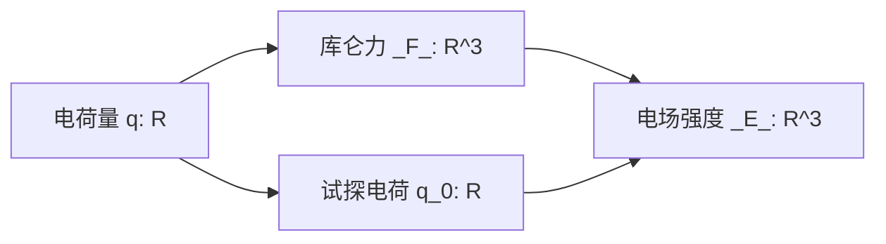

# 9.1  电场  电场强度

## 9.1.1  电荷

> **电荷守恒定律**
> 
> 在一孤立系统内,无论发生怎样的物理过程,系统的电荷量保持不变.

---
> **电荷的量子化**
>
> 电荷只能取分立的、不连续的量值.

---
> **电荷的相对论不变性**
>
> 电荷的电量与运动状态无关.

## 9.1.2  库仑定律

> 真空中 两点电荷间 相互作用力的大小
> 
> $$F = k \frac{q _1 q_ 2}{r ^2}$$
> 
> > 用另一个常数 $\varepsilon _0$ 表示 $k$
> > 
> > $$k = \frac{1}{4 \pi \varepsilon _0}$$
> > 
> > $$F = \frac{1}{4 \pi \varepsilon _0} \frac{q _1 q _2}{r ^2}$$

---
> 真空中两点电荷间相互作用力
> 
> $$\mathbf{F} = \frac{1}{4 \pi \varepsilon _0} \frac{q _1 q _2}{r ^2} \mathbf{r} _0$$

---
> **静电力的叠加原理**
> 
> $$
\mathbf{F}
= \sum _{i = 1} ^{n} \mathbf{F} _i
$$

## 9.1.3  电场强度

> **静电场**
>
> 相对于观察者的静止的带电体的周围存在的电场.

---
> **静电场对外的表现**
>
> 处于电场中的任何带电体, 受到电场所作用的力.
>
> 当带电体在电场中运动时, 电场所作用的力将对带电体做功.

---
> **电场强度**
>
> 试验电荷 $q _0$ 在一点处的受力反映此处电场的性质
> 
> $$\mathbf{E} = \frac{\mathbf{F}}{q _0}$$

## 9.1.4  电场强度的叠加原理

$$
\mathbf{E}
= \sum _{i = 1} ^{n} \mathbf{E} _i
$$

## 9.1.5  电场强度的计算

- 点电荷的电场
- 点电荷系的电场
- 电荷连续分布的带电体的电场

> 点电荷的电场
> 
> > 某点处试验电荷所受静电力
> > 
> > $$
\mathbf{F}
= \frac{1}{4 \pi \varepsilon _0} \frac{q _0 q}{r ^2} \mathbf{r} _0
$$
> 
> ---
> > 某点处电场强度
> > 
> > $$
\mathbf{E}
= \frac{1}{4 \pi \varepsilon _0} \frac{q}{r ^2} \mathbf{r} _0
$$

---
> 点电荷系的电场
> 
> > 某点处总电场强度
> > 
> > $$
\mathbf{E}
= \sum _{i = 1} ^{n}
\frac{1}{4 \pi \varepsilon _0} \frac{q _i}{r _i ^2} \mathbf{r} _{i 0}
$$

---
> 电荷连续分布的带电体的电场
> 
> > 某点处总电场强度  微分形式
> > 
> > $$
\text{d} \mathbf{E}
= \frac{\text{d} q}{4 \pi \varepsilon _0 r ^2} \mathbf{r} _0
$$
> 
> ---
> > 某点处总电场强度  积分形式
> > 
> > $$
\mathbf{E}
= \int _V \text{d} \mathbf{E}
= \int _V
\frac{1}{4 \pi \varepsilon _0} \frac{\text{d} q}{r ^2} \mathbf{r} _0
$$

### 9.1.6  带电体在外电场中所受的作用

> 点电荷 $q$ 放在电场强度为 $\mathbf{E}$ 的外电场的某一点
> 
> $$\mathbf{F} = q \mathbf{E}$$
